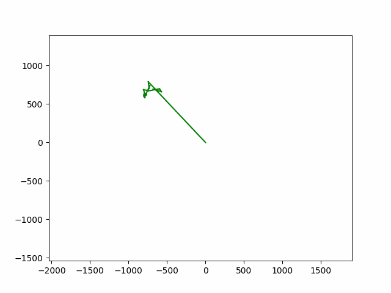

# Fourier Line Art

Fourier Line Art is a Python program that takes an SVG file, extracts points from its outline, fits a Fourier series to these points, and then animates the drawing of the series. The animation is saved as a GIF file.



## Installation

### Install

1. Clone the repository:
   ```
   git clone https://github.com/jdleaverton/FourierLineArt.git
   ```
2. Navigate to the project directory:
   ```
   cd FourierLineArt
   ```
3. Create a Python virtual environment and activate it:
   ```
   python3 -m venv env
   source env/bin/activate
   ```
4. Install the package using pip:
   ```
   pip install .
   ```

## Usage

To demonstrate the animation of the Fourier drawing, you can use the main.py script with an SVG file as input. For example, to animate the drawing of the Texas outline, you can use the Texas.svg file with the following command:

```
python main.py "src/Texas.svg" --num_points 256 --num_coefficients 256
```

This will create an animation of the Fourier drawing and save it as a GIF file named animation.gif. Currently, this only works on simple, monolithic svg designs with no 'holes' in the contours. For example, a circle would be fine but a donut would not. 


